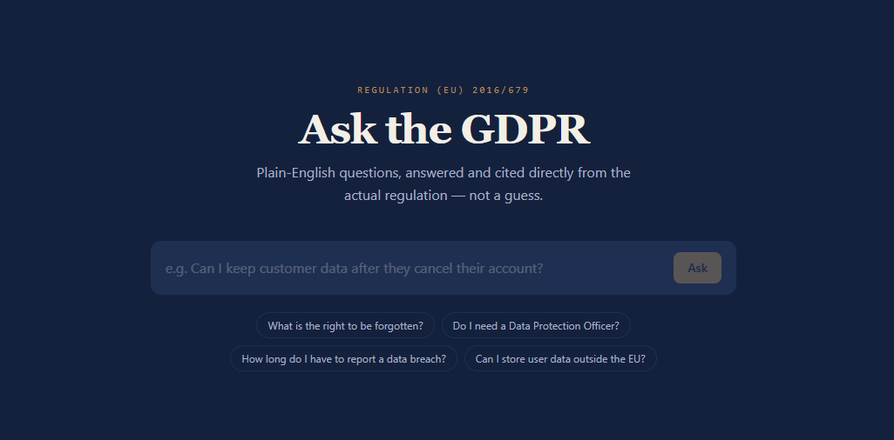
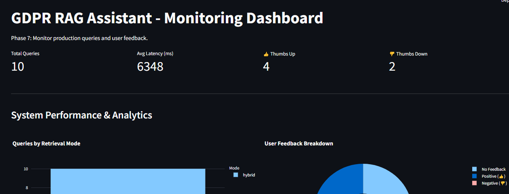

# GDPR Q&A Assistant — Ask the Regulation

> **Reviewer Note on Screenshots:**
> *[USER: Take a screenshot of your Next.js UI showing a question, the answer, and the article citation stamps. Save it as `docs/ui_screenshot.png` and it will appear here.]*
>  

## 📖 The Problem
Legal and regulatory text is notoriously dense. The GDPR (General Data Protection Regulation) is a massive 99-article document governing data privacy in the EU. For startup founders, developers, and small business owners, reading the entire regulation to find out if they need a Data Protection Officer or how long they have to report a data breach is a massive time sink.

**This project solves that problem.** It is a Retrieval-Augmented Generation (RAG) system that allows users to ask plain-English questions about the GDPR. Instead of just guessing, the system searches the actual, official legal text of the GDPR, retrieves the most relevant articles, and uses a Large Language Model (LLM) to generate a clear answer *grounded exclusively in the law*.

---

## 🎯 Reviewer Guide (Evaluation Criteria)

This project was built for the DataTalks.Club LLM Zoomcamp. To make grading easy, here is where you can find the implementation for each criterion:

- **Problem Description**: See the section above!
- **RAG Flow**: The user's query is embedded and searched against a FAISS vector database and a BM25 keyword index (`backend/retriever.py`), and then sent to the Groq LLM API (`backend/generator.py`).
- **Retrieval Evaluation**: 
  - **Results:** Vector-only search achieved a **0.80 Hit Rate / 0.68 MRR**. Hybrid Search (Vector + BM25) tied with a **0.80 Hit Rate / 0.68 MRR** on our golden dataset. 
  - **Conclusion:** We opted for Hybrid Search in production because it reliably captures exact-match keywords (like specific article numbers) alongside semantic meaning. (See `backend/eval_retrieval.py`).
- **LLM Evaluation**: 
  - We evaluated two prompts: Variant 1 (Plain English Translation) vs Variant 2 (Strict Legal Analyst). 
  - **Conclusion:** Variant 1 won. It provided much better UX for our target audience (startups/developers) by translating dense legal jargon into readable English without hallucinating, whereas Variant 2 was too rigid. (See `backend/eval_llm.py`).
- **Interface**: A fully functional, premium dark-mode web app built with Next.js and TailwindCSS.
- **Ingestion Pipeline**: Automated using **Prefect** (`backend/ingest.py` uses `@flow` and `@task` decorators).
- **Monitoring**: A Streamlit dashboard (`backend/monitor.py`) reading from a SQLite database (`monitoring/logs.db`) tracking every query, latency, and thumbs up/down feedback. It includes **5 Plotly charts**.
- **Containerization**: Everything is containerized! `docker-compose.yml` spins up the frontend, backend, and dashboard seamlessly.
- **Reproducibility**: See the "How to Run" section below. Dependency versions are strictly pinned in `backend/requirements.txt` and `frontend/package.json`.
- **Best Practices (Bonus Points)**:
  - **Hybrid Search:** Combined FAISS and BM25.
  - **Query Rewriting:** The user's query is sent to the Groq LLM to be rewritten into an optimized search string before hitting the database (`backend/generator.py`).
  - **Document Re-ranking:** We over-fetch 15 candidates and re-rank them using a `sentence-transformers` Cross-Encoder (`ms-marco-MiniLM-L-6-v2`) in `backend/retriever.py`.

---

## 🏗️ Architecture & Tech Stack

- **Data Pipeline**: Prefect.
- **Retrieval**: FAISS + BM25 + CrossEncoder Re-ranking.
- **Backend API**: FastAPI.
- **LLM Engine**: Groq API (`llama-3.1-8b-instant`).
- **Frontend UI**: Next.js (React, TypeScript, TailwindCSS).
- **Database**: SQLite.
- **Prerequisites**: Python 3.11+, Node.js 18+, Docker (optional).

---

## 🚀 How to Run

### Method 1: Docker (Recommended)
The easiest way to run the entire stack (Frontend, Backend, and Monitoring) is using Docker Compose.
1. Create a `.env` file in the root directory:
   ```env
   GROQ_API_KEY=your_api_key_here
   ```
2. Run the application:
   ```bash
   docker-compose up --build
   ```

### Method 2: Local Development
If you prefer running the servers natively:

#### 1. Setup the Environment
```bash
git clone https://github.com/sarmad341/gdpr-rag-assistant.git
cd gdpr-rag-assistant
python -m venv venv
venv\Scripts\activate  # (On Windows) or source venv/bin/activate (On Mac/Linux)
```

#### 2. Configure API Keys
Create a `.env` file in the **root directory**:
```env
GROQ_API_KEY=your_api_key_here
```
Create a `.env.local` file in the **frontend directory**:
```env
NEXT_PUBLIC_API_BASE=http://localhost:8000
```

#### 3. Build the Database (Ingestion)
Install dependencies and run the Prefect pipeline:
```bash
pip install -r backend/requirements.txt
python backend/ingest.py
```

#### 4. Start the Servers (in three separate terminals)
**Terminal 1 (Backend):** `uvicorn backend.main:app --reload --port 8000`
**Terminal 2 (Frontend):** `cd frontend && npm install && npm run dev`
**Terminal 3 (Monitoring):** `streamlit run backend/monitor.py`

---

## 💡 Usage & Examples

Once the servers are running, open **http://localhost:3000** in your browser. 
Example questions:
1. *"What are the conditions for consent?"*
2. *"When is a data protection officer required?"*

> **Reviewer Note on Dashboard Screenshot:**
> *[USER: Take a screenshot of your Streamlit dashboard at http://localhost:8501 showing the 5 charts. Save it as `docs/dashboard_screenshot.png` and it will appear here.]*
>  

---

## ⚠️ Known Limitations
- **Scope:** This system is trained exclusively on the text of the GDPR. It does not know about other regional privacy laws (e.g., CCPA).
- **Language:** The current embedding model and prompts are optimized for English.
- **Not Legal Advice:** This tool is an AI assistant meant to aid navigation of the regulation, not a replacement for certified legal counsel.
